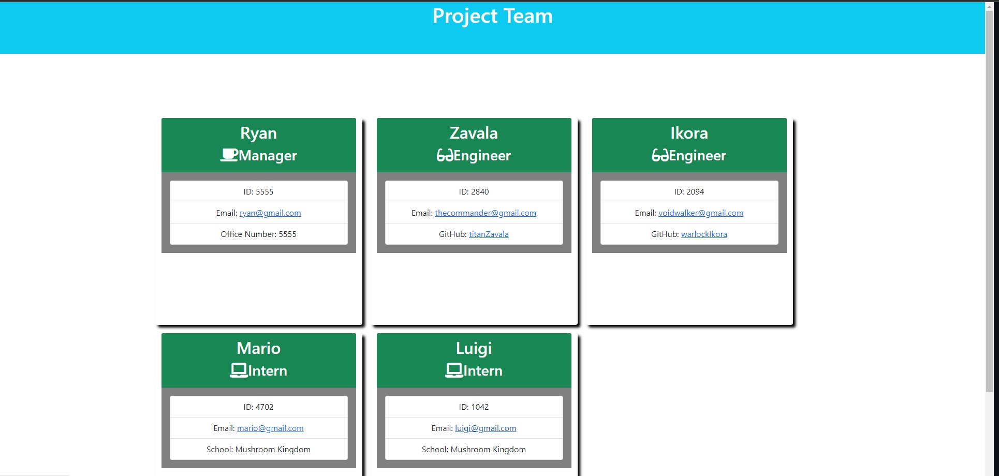

# Team Profile Generator

## Table of Contents
* [Description](#description)
* [Installation](#installation)
* [Screenshot](#screenshot)
* [Video](#video)
* [Usage](#usage)
* [Licenses](#license)
* [Questions](#questions)
* [Credits](#credits)
=======

## Description
- Team Profile Generator allows you to create a organized team consiting of a manager, engineers, and interns.
- Using nodejs, terminal, or GitBash, the user is prompted with a series of questions. When answered a HTML page will be generated consisting of the infomation they have answered.

## Installation
Node.js to run terminal prompts and Jest to test.

## Screenshot

## Video
https://user-images.githubusercontent.com/115953057/217714659-766350d6-98f1-4a2a-beec-8adfe8e8eb86.mp4

## Usage
To create a Team Profile 

## Licenses
This project is covered under the MIT license. click the license button at the top to learn more.

https://opensource.org/licenses/MIT

## Questions
Questions regarding this project?
GitHub: https://github.com/Ryebread5555
Email: rypetty55@gmail.com

## Credits
- Bootstrap
- NodeJS
- Jest
- Inquirer
- jquery

